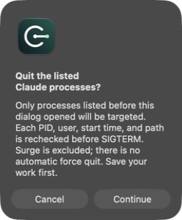

<div align="center">
  
  <h1>fuck-anthropic guard</h1>
  <p><strong>Know what Claude is running. Keep its network path in check.</strong></p>
  <p>A local macOS companion for Surge — process controls, connection checks and safety alerts.</p>
  <p><strong>English</strong> · <a href="README.zh-CN.md">简体中文</a></p>
  <p><a href="docs/UserGuide.en.md">User guide</a> · <a href="docs/FEATURE-STATUS.md">What's verified</a> · <a href="SECURITY.md">Security</a> · <a href="CONTRIBUTING.md">Contribute</a></p>
  <p><code>macOS 14+</code> &nbsp; <code>Apple Silicon + Intel</code> &nbsp; <code>MIT</code></p>
</div>

> **Notarized beta · protection is opt-in.** Live failure testing is still pending; signing and notarization are not a zero-IP-leak or account-safety guarantee.

<p align="center">
  <a href="docs/images/preview-en.png"></a>
  <br><sub>Running offline Preview · sample data · not evidence of live filtering</sub>
</p>

## Three things, one window

| See what's running | Guard the connection | Quit before disconnecting |
|---|---|---|
| Recognized Claude Desktop, native CLI and traceable descendants, plus read-only IPv6 settings. | Opt-in filtering restricts recognized clients to a verified Surge endpoint. Failed checks or expired permission revoke access. | Confirm one action to quit the listed processes. Check they have exited before turning off your proxy. |

Surge forwards the traffic. Guard does not provide a VPN or SSH tunnel, read VPS private keys, or change your network settings. Its goal is to reduce accidental direct connections when your proxy or network changes.

<details>
<summary><strong>See the confirmation and blocked-state examples</strong></summary>

The confirmation freezes the target list before acting. Preview uses sample processes only.

<p align="center"></p>

The blocked state below is a simulation. Switching languages preserves that state.

<p align="center"></p>

</details>

## Install the beta

```bash
brew install --cask leizikang/tap/fuck-anthropic-guard
```

Or download the [signed, notarized beta ZIP](https://github.com/LeiZiKang/fuck-anthropic-guard/releases/tag/v0.4.0-beta.1). Installing does not activate or validate the filter. Configure and approve protection explicitly; live failure acceptance remains pending.

**Upgrading from Claude Connection Watcher:** disable protection, confirm it is disabled, and quit the old app first. The old and new apps share bundle identifiers. Remove the old cask separately; do not run a manually installed old copy alongside the new app. Follow the same disable-and-quit steps before uninstalling or upgrading this beta.

## Try the offline Preview

Requires Xcode or compatible Command Line Tools and Python 3. Preview does not signal real processes, send probes or activate a filter.

```bash
git clone --branch codex/feature-surge-guard-public https://github.com/LeiZiKang/fuck-anthropic-guard.git
cd fuck-anthropic-guard
bash scripts/build.sh
open "dist/guard/fuck-anthropic guard Preview.app"
```

Choose **English / 简体中文** in the window. Production remembers your selection; Preview keeps it in memory only.

## Before enabling real protection

This version requires a **dedicated Surge listener**, a first `IN-PORT` rule pinned to one supported Hysteria2 node, valid signing, and macOS filter approval. Shared proxy ports and ordinary Dock launches may not use that path. Follow the [setup guide](docs/UserGuide.en.md) first.

Unknown processes, provider crashes, early boot packets and network transitions have coverage limits. There is a detection window; blocking is not guaranteed to be instantaneous. See [what is verified](docs/FEATURE-STATUS.md) and the [security model](SECURITY.md).

<details>
<summary><strong>Build the host and filter · contributor details</strong></summary>

```bash
bash scripts/test.sh
CCW_BUILD_MODE=host bash scripts/build.sh
```

These commands build without installing. Ad-hoc signing does not establish protection. In `ClaudeConnectionWatcher.xcodeproj`, **01 Preview (Safe)** is the default Run scheme; production schemes are build-only. Set `CCW_ARCHITECTURES='arm64 x86_64'` for a Universal 2 build.

Read [Contributing](CONTRIBUTING.md), [design and scope](docs/PRD.en.md), and [release notes](docs/RELEASE-NOTES.md). An [offline HTML guide](docs/UserGuide.en.html) is also included in the source; download it to read in a browser. GitHub displays HTML files as source code.

</details>

---

Process metadata stays local. Consented exit checks use Surge to reach `api.ipify.org` without Claude credentials. No telemetry or automatic direct fallback. [MIT license](LICENSE).
