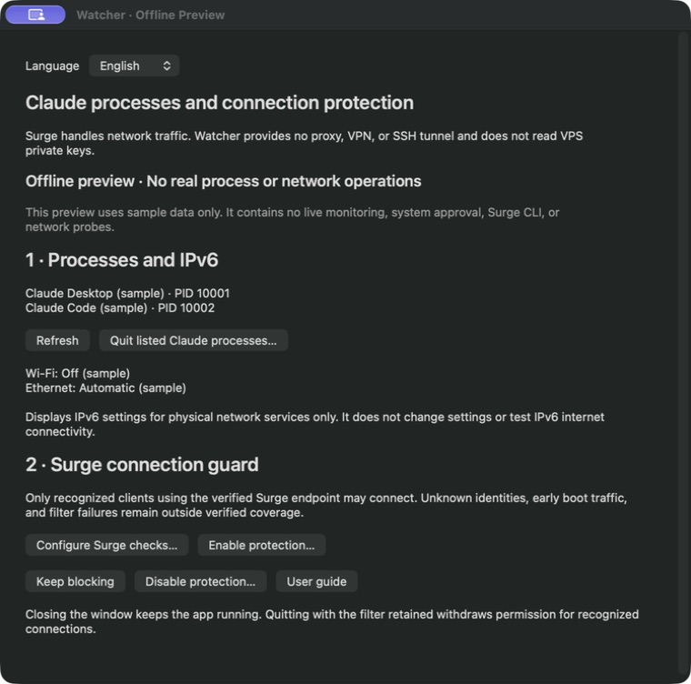
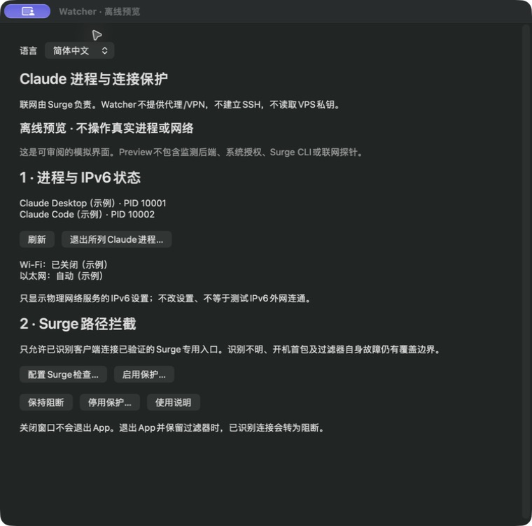
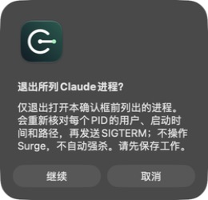
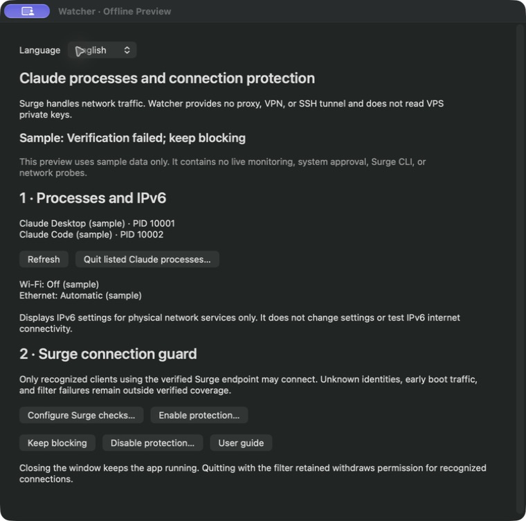

# Claude Connection Watcher

A local macOS companion for **Surge**, with two responsibilities:

1. List recognized Claude Desktop / native CLI processes, terminate selected recognized processes after confirmation, and show read-only IPv6 service settings.
2. Restrict recognized clients to a verified **Surge-owned** proxy endpoint using a macOS Network Extension.

**Watcher is not a proxy, VPN, SSH tunnel, or credential cleaner.** It does not read VPS private keys or modify Surge, DNS, routes, or IPv6 settings.

> **0.4.0 pre-release / build 12.0 — experimental.** Offline tests and compilation are not live system-wide acceptance. Provider crashes, boot first packets, unidentified descendants and all network transitions are not guaranteed fail-closed. No account-safety or zero-IP-leak promise.

## Interface and workflow / 界面与操作示例

These screenshots were captured from the **running offline Preview**, using sample PIDs and settings. They show the real UI and interaction flow, **not evidence of live network blocking**. 此处为实际运行的离线 Preview 截图，使用示例数据，不代表真实过滤验收。

| English | 简体中文 |
|---|---|
|  |  |

1. Choose **English / 简体中文** at the top. The interface switches immediately without restarting monitoring. 正式版记住选择，Preview 仅保存在内存。
2. **Quit listed Claude processes…** asks for confirmation before acting on the frozen process identities. The screenshot below shows that confirmation; sample processes are never real user processes.



3. **Keep blocking** demonstrates the blocked presentation. Changing languages preserves this state. This image is a simulation, not a production filter result.



## Read first

- [English HTML guide](docs/UserGuide.en.html) / [中文 HTML 说明书](docs/UserGuide.html) — standalone, offline, printable.
- [Markdown manual](docs/UserGuide.md)
- [PRD](docs/PRD.md)
- [Validation status and limitations](docs/FEATURE-STATUS.md)
- [Security model](SECURITY.md)

## Build and review

Requires macOS 14+, Xcode or compatible Command Line Tools, and Python 3. No package dependencies.

```bash
bash scripts/build.sh                  # isolated offline Preview
bash scripts/test.sh                   # pure/offline tests, no live clients killed
CCW_BUILD_MODE=host bash scripts/build.sh  # host + filter, not installed
```

Open `ClaudeConnectionWatcher.xcodeproj`; **01 Preview (Safe)** is the default Run scheme. Production targets are build-only. Production signing and Network Extension provisioning are required before installation; ad-hoc builds do not establish protection.

Default output: `dist/guard/`. For a Universal 2 build, set `CCW_ARCHITECTURES='arm64 x86_64'`.

## Connection model

```text
Claude → dedicated local port owned by Surge → one Hysteria2 policy → your VPS
              ↑
        Watcher verifies and filters; it does not forward traffic
```

Shared Surge ports can legitimately select DIRECT for other applications. Strict guard mode therefore requires a separate **Surge listener** (example: 6154) and a first `IN-PORT` rule pinned to one Hysteria2 node. Existing Xcode/other routing rules can remain on the shared listener. Setup is explicit and manual; the app does not change your profile.

The optional `scripts/launch-claude-via-surge.sh` configures only the launched client's proxy environment/arguments. Normal Dock launches may retain the shared system proxy and be blocked when strict protection is enabled. See the manual before enabling protection.

## Privacy and release

Process metadata is local. Explicitly enabled checks query the signed Surge CLI and use a cookie-free proxy-bound request to `api.ipify.org` to compare the expected exit. No telemetry, model calls, credential export, or automatic fallback.

Public releases require an independent review of the frozen source/history/artifacts. Feature branches remain unmerged until the maintainer accepts them. Existing historical releases may contain different functionality; this branch documents the reduced scope.

License: [MIT](LICENSE).
