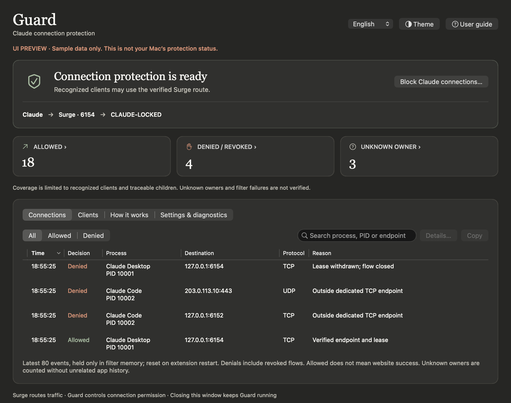

<div align="center">
  
  <h1>fuck-anthropic guard</h1>
  <p><strong>See Claude connections. Keep recognized clients on your Surge route.</strong></p>
  <p>An independent macOS utility. Surge provides the proxy; Guard checks connection permission.</p>
  <p><strong>English</strong> · <a href="README.zh-CN.md">简体中文</a></p>
  <p><code>macOS 14+</code> · <code>Apple Silicon + Intel</code> · <code>MIT</code></p>
</div>

> **0.4.4 stable · protection is opt-in.** Unknown process attribution and OS failure/lifecycle cases remain coverage limits. This is not a VPN or an account-safety guarantee.

<p align="center"><br><sub>Offline sample data, not evidence of live filtering.</sub></p>

## What it does

- Recognizes signed Claude Desktop, native Claude Code and traceable same-user descendants.
- Restricts recognized connections to a dedicated Surge TCP endpoint while route evidence remains valid.
- Shows the latest 80 connection decisions in memory: process, PID, destination, protocol and available trigger. Search, sort, inspect or copy a record.
- Confirms manual blocking and process termination. Shows read-only IPv6 settings and safety notifications.
- Provides a bilingual dark/light interface and compact menu panel, with four real Xcode Canvas previews sharing the production AppKit view.

**Surge forwards traffic.** Guard does not supply a proxy/VPN/SSH tunnel, edit Surge or system networking, or read VPS private keys. A journal target such as `127.0.0.1:6154` is the local proxy endpoint, not the final website. Allowed does not mean the website request succeeded.

## Download and setup

Download the [Developer ID signed, notarized Universal 2 ZIP](https://github.com/LeiZiKang/fuck-anthropic-guard/releases/tag/v0.4.4). Read the [setup and upgrade guide](docs/UserGuide.en.md) before enabling protection.

The [Homebrew tap](https://github.com/LeiZiKang/homebrew-tap) now offers the same notarized **0.4.4 / build 13.0** archive. Install with `brew install --cask leizikang/tap/fuck-anthropic-guard`, or run `brew update` and `brew upgrade --cask leizikang/tap/fuck-anthropic-guard` for an existing installation. Follow the upgrade guide before replacing an active filter.

Protection requires a separately configured Surge listener, a first `IN-PORT` rule pinned to one supported Hysteria2 node, valid signing and macOS approval. Installing the app does not establish coverage. Keep Claude clients closed during setup or upgrade, keep Surge running, and verify readiness before reopening them.

See [release notes](docs/RELEASE-NOTES.md), [validation status](docs/FEATURE-STATUS.md), and the [security model](SECURITY.md). Physical network loss, boot, wake and provider crashes are not fully live-validated.

## Develop safely

```bash
git clone https://github.com/LeiZiKang/fuck-anthropic-guard.git
cd fuck-anthropic-guard
bash scripts/test.sh
open "dist/guard/fuck-anthropic guard Preview.app"
```

The default Preview uses sample data and never activates the production filter. Open `ClaudeConnectionWatcher.xcodeproj` with **01 Preview (Safe)** for development. Canvas previews in `App/main.swift` cover ready, blocked, checking and disabled menu states. `CCW_CANVAS` is enabled only in the Xcode Preview target; the standalone CLI build does not require the Canvas macro plugin.

Production schemes are build-only. `CCW_BUILD_MODE=host bash scripts/build.sh` compiles without installing; `CCW_ARCHITECTURES='arm64 x86_64'` builds both architectures. Prefer Xcode MCP for incremental builds and diagnostics. See [contributing](CONTRIBUTING.md) and [branch/release workflow](docs/BRANCHES.md).

Process and connection metadata remain local. Consented exit probes reach `api.ipify.org` through Surge without Claude credentials. No telemetry or automatic direct fallback. [MIT license](LICENSE).
