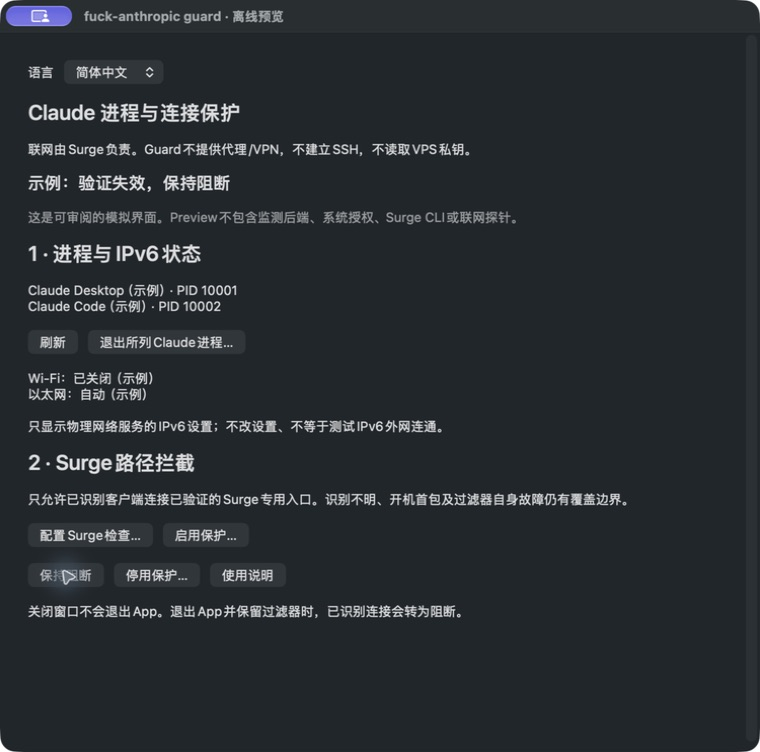

# fuck-anthropic guard


<table><tr><td><a href="README.md">English</a></td><td><strong>简体中文</strong></td></tr></table>

**为本地运行的 Claude 增加一道网络防护。**

Guard 配合 Surge，旨在降低代理中断或网络变化时 Claude 意外直连、向 Anthropic 暴露本机公网 IP 的风险。正确配置并启用系统过滤后，当检查失败、放行许可过期或保护模块收到网络变化事件时，设计上会撤销许可，阻断可识别的 Claude 相关进程连接，并在自动监测发现异常时提醒您。

准备关闭 VPN／Surge 时，可先使用“一键退出”功能，经确认后退出所列 Claude 进程；**确认进程已经退出，再关闭代理**。这能帮助减少误操作导致的直连风险，但不能保证 Claude 账号不会受限。

当前版本面向 **Surge 专用入口**，不是通用于任意 VPN 的保护工具。以上是已实现的设计行为；新版在代理中断、断网和重启等真实场景中的阻断效果仍待实机验收，不保证即时、全进程或零 IP 泄漏。

一个配合 **Surge** 使用的本地 macOS 工具，专注两件事：

1. 显示可识别的 Claude Desktop、原生 CLI 及相关进程，确认后退出所列进程，并只读查看 IPv6 服务设置。
2. 通过 macOS 网络扩展，将可识别客户端的连接限制到已验证、**由 Surge 监听**的代理入口。

**Guard 不提供代理、VPN、SSH 隧道或凭据清理。** 不读取 VPS 私钥，也不修改 Surge、DNS、路由或 IPv6 设置。

> **0.4.0 预发布 / build 12.0 — 实验版本。** 离线测试和编译通过不等于真实系统验收。过滤器崩溃、开机首包、无法识别的后代和所有网络切换场景，均未证明能够始终阻断。不承诺账号安全或零 IP 泄漏。

## 界面与操作示例

以下截图来自**实际运行的离线 Preview**，使用示例 PID 与设置，展示真实界面和操作流程，**不是实际网络拦截成功的证据**。


1. 在窗口顶部选择 **简体中文 / English**，界面立即切换，不重启监测。正式版记住选择，Preview 仅在内存保存。
2. 点击**退出所列 Claude 进程…**后确认；程序只处理打开确认框前冻结的进程身份集合。下图为确认界面，示例进程不是用户的真实进程。


3. 点击**保持阻断**可查看阻断状态示例；切换语言后保留该状态。下图是模拟展示，不是生产过滤器的验证结果。



## 开始前阅读

- [中文 HTML 说明书](docs/UserGuide.html) / [English HTML guide](docs/UserGuide.en.html)：可独立离线阅读、打印。
- [中文 Markdown 说明书](docs/UserGuide.md)
- [产品需求 PRD](docs/PRD.md)
- [验证状态与限制](docs/FEATURE-STATUS.md)
- [安全模型](SECURITY.md)

## 构建与审阅

需要 macOS 14 或以上、Xcode 或兼容的 Command Line Tools，以及 Python 3。没有第三方软件包依赖。

```bash
bash scripts/build.sh                     # 构建独立离线 Preview
bash scripts/test.sh                      # 离线检查，不终止真实客户端
CCW_BUILD_MODE=host bash scripts/build.sh  # 构建主程序与过滤器，不安装
```

打开 `ClaudeConnectionWatcher.xcodeproj`，默认运行方案为 **01 Preview (Safe)**。生产目标仅用于构建。安装生产过滤器需要正式签名及 Network Extension 权限配置；ad-hoc 构建不能证明保护生效。

默认产物目录：`dist/guard/`。构建 Intel 与 Apple Silicon 通用版本时，设置 `CCW_ARCHITECTURES='arm64 x86_64'`。

## 连接方式

```text
Claude → Surge 自己监听的专用本机端口 → 单个 Hysteria2 策略 → VPS
                  ↑
         Guard 验证并过滤，不转发流量
```

Surge 的共享入口可能为其他应用合法选择 DIRECT。因此严格保护模式要求独立的 **Surge 监听端口**（示例：6154），并将固定到单个 Hysteria2 节点的 `IN-PORT` 规则放在首位。原有 Xcode 及其他分流规则可继续用于共享入口。配置由用户明确、手动完成，App 不会修改配置文件。

可选的 `scripts/launch-claude-via-surge.sh` 只设置本次启动客户端的代理环境变量或参数。从 Dock 正常启动的客户端可能继续使用共享系统代理，因此在严格保护启用时被阻断。启用前请阅读说明书。

## 隐私与发布

进程信息留在本机。用户明确启用后，检查通过签名的 Surge CLI 读取配置，并经指定代理向 `api.ipify.org` 发送不带 Cookie 的请求，比较预期出口。没有遥测、模型调用、凭据导出或自动直连回退。

公开发布前需要独立审查冻结源码、历史和精确产物。功能分支等待维护者验收后才合并。历史版本可能包含不同功能，请以本分支所说明的精简范围为准。

许可证：[MIT](LICENSE)。
