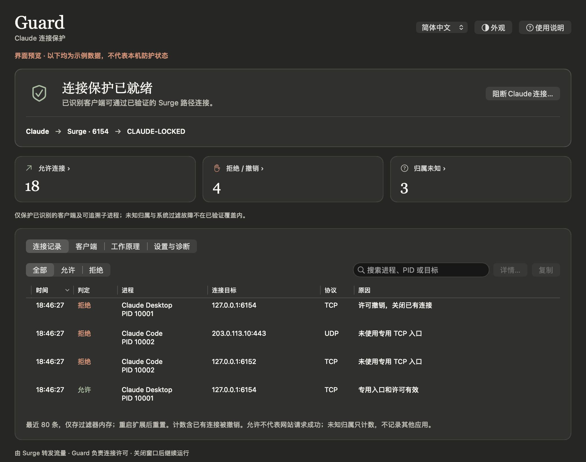

<div align="center">
  
  <h1>fuck-anthropic guard</h1>
  <p><strong>看清Claude连接，让已识别客户端使用指定Surge路径。</strong></p>
  <p>独立macOS工具：Surge负责代理，Guard检查连接许可。</p>
  <p><a href="README.md">English</a> · <strong>简体中文</strong></p>
  <p><code>macOS 14+</code> · <code>Apple Silicon + Intel</code> · <code>MIT</code></p>
</div>

> **0.4.4正式版 · 保护需主动启用。** 未知进程归属和系统故障／生命周期仍存在覆盖边界。Guard不是VPN，也不保证账号安全。

<p align="center"><br><sub>离线示例数据，不代表真实过滤已生效。</sub></p>

## 功能

- 识别签名验证通过的Claude Desktop、原生Claude Code及可追溯的同用户子进程。
- 在路径证据有效时，把已识别连接限制到Surge专用TCP入口。
- 内存保留最近80条连接判定：进程、PID、目标、协议及可用的触发原因；支持搜索、排序、详情和复制。
- 手动阻断及退出进程前明确确认；提供只读IPv6信息与安全通知。
- 中英文、深浅色界面与菜单栏面板；四个真正的Xcode Canvas预览复用正式AppKit视图。

**Surge负责转发流量。** Guard不提供代理/VPN/SSH，不编辑Surge或系统网络，不读取VPS私钥。日志中的`127.0.0.1:6154`是本机代理入口，不是最终网站；允许连接不等于网站请求成功。

## 下载与设置

下载[Developer ID签名并通过Apple公证的Universal 2 ZIP](https://github.com/LeiZiKang/fuck-anthropic-guard/releases/latest)。启用前先读[设置与升级说明](docs/UserGuide.md)。

[Homebrew tap](https://github.com/LeiZiKang/homebrew-tap) 已同步相同的公证包 **0.4.4 / build 13.0**。新安装使用 `brew install --cask leizikang/tap/fuck-anthropic-guard`；已有安装先 `brew update`，再 `brew upgrade --cask leizikang/tap/fuck-anthropic-guard`。替换正在使用的过滤器前，请先阅读升级说明。

保护需要另行配置Surge专用监听入口、固定到单个受支持Hysteria2节点的首条`IN-PORT`规则、有效签名和macOS授权。安装本身不证明覆盖生效。设置或升级时先关闭Claude客户端，保持Surge运行，确认就绪后再打开客户端。

详见[发布说明](docs/RELEASE-NOTES.zh-CN.md)、[验证状态](docs/FEATURE-STATUS.zh-CN.md)和[安全模型](SECURITY.zh-CN.md)。物理断网、开机、唤醒及过滤器崩溃尚未完成全部实机验收。

## 安全开发

```bash
git clone https://github.com/LeiZiKang/fuck-anthropic-guard.git
cd fuck-anthropic-guard
bash scripts/test.sh
open "dist/guard/fuck-anthropic guard Preview.app"
```

默认Preview使用示例数据，不启用生产过滤器。在Xcode打开`ClaudeConnectionWatcher.xcodeproj`，使用 **01 Preview (Safe)**。`App/main.swift`中的Canvas涵盖菜单栏就绪、阻断、验证中和未开启状态；`CCW_CANVAS`只在Xcode Preview目标启用，命令行构建不依赖Canvas宏插件。

生产scheme仅用于构建。`CCW_BUILD_MODE=host bash scripts/build.sh`不会安装；设置`CCW_ARCHITECTURES='arm64 x86_64'`可编译双架构。增量构建和诊断优先使用Xcode MCP。详见[贡献指南](CONTRIBUTING.zh-CN.md)和[分支／发布流程](docs/BRANCHES.md)。

进程与连接元数据保留在本机。经同意的出口探针通过Surge访问`api.ipify.org`，不携带Claude凭据。无遥测，不自动回退直连。[MIT许可证](LICENSE)。

[自动发布管道](docs/AUTOMATED-RELEASES.md)：main 中提交新版本后自动构建、公证、发布下载包并更新 Homebrew。
